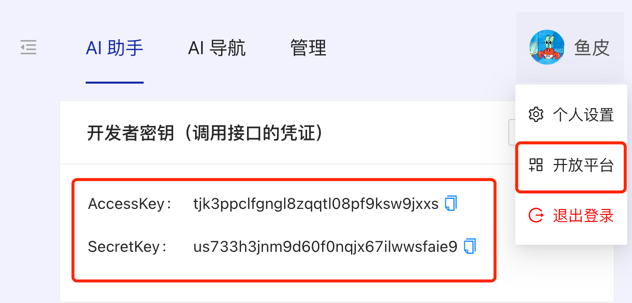
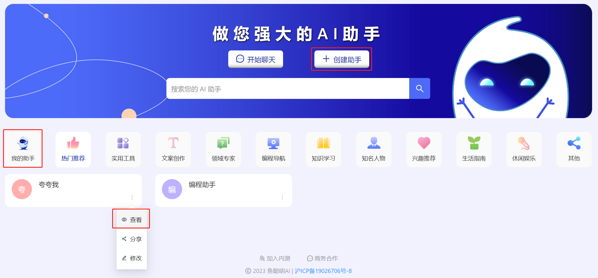
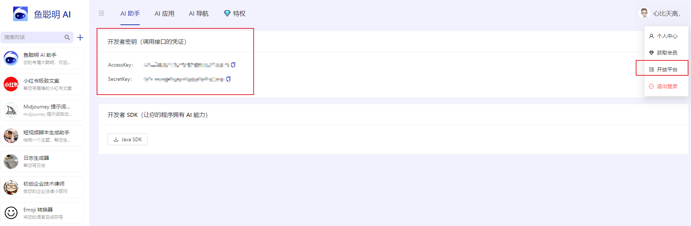

# 鱼聪明 Java SDK

基于 Spring Boot Starter 开发，只需一行代码，使用强大的 AI 能力！

鱼聪明 AI：https://yucongming.com

官方公众号：鱼聪明AI


## 快速开始

#### 0、引入 sdk

```xml
<dependency>
    <groupId>com.yucongming</groupId>
    <artifactId>yucongming-java-sdk</artifactId>
    <version>0.0.3</version>
</dependency>
```

#### 1、在 [鱼聪明 AI 开放平台](https://www.yucongming.com/dev) 获取开发者密钥对



#### 2、初始化 YuCongMingClient 对象

方法 1：自主 new 对象

```java
String accessKey = "你的 accessKey";
String secretKey = "你的 secretKey";
YuCongMingClient client = new YuCongMingClient(accessKey, secretKey);
```

方法 2：通过配置注入对象

修改配置：

```yaml
yuapi:
  client:
    access-key: 你的 access-key
    secret-key: 你的 secret-key
```

使用客户端对象：

```java
@Resource
private YuCongMingClient client;
```

#### 3、构造请求参数

```java
DevChatRequest devChatRequest = new DevChatRequest();
devChatRequest.setModelId(1651468516836098050L);
devChatRequest.setMessage("鱼皮");
```

#### 4、获取响应结果

```java
BaseResponse<DevChatResponse> response = client.doChat(devChatRequest);
System.out.println(response.getData());
```


## API 文档

### AI 对话

方法名：doChat

请求参数：

- modelId：使用的会话模型（助手）id
- message：要发送的消息，不超过 1024 字

响应结果：

- code：响应状态码
- data： 
  - content：对话结果内容
- message：响应信息


示例代码：

```java
// 构造请求
DevChatRequest devChatRequest = new DevChatRequest();
devChatRequest.setModelId(1651468516836098050L);
devChatRequest.setMessage("鱼皮");

// 获取响应
BaseResponse<DevChatResponse> response = client.doChat(devChatRequest);
System.out.println(response.getData());
```

模型（助手）：

设置自己的模型（助手）可以使AI的回答更加个性化，如 “1651468516836098050” 这个模型（助手）id会更加倾向于回答歌曲和歌单，你可以通过平台首页的 “创建助手” 和 “我的助手” 功能来创建、查看和修改模型（助手），查看模型（助手）即可看到模型（助手）id。




## Http 接入

1. 获取 **AccessKey** 和 **SecretKey**

2. 请求信息

   URL ：[https://www.yucongming.com/api/dev/chat]()
   请求方法：POST
   请求头：
   
   | 请求头名称 | 值 | 示例值 |
   | --- | --- | --- |
   | accessKey | accessKey | 9vtw6bx8eh65uu5q62a8nhqdjf2asapp |
   | nonce | 四位随机整数 | 1234 |
   | body | 请求参数的 md5 加密值，请求参数详情见下方 | cf2623df4bf9d0485b0ab9392cbcef11 |
   | timestamp | 当前时间戳（单位秒） | 1687775370 |
   | sign | 签名，详情见下方 | d10ce4n429778060c0af1d5f3f388d39953e74d996022e6182094fa3a84adbe9 |

3. 请求参数

   | modelId | 模型（助手）id |
   | --- | --- |
   | message | 消息（问题） |

4. 签名认证 

   签名的值是 **请求参数的 md5 加密值 + . + SecretKey 的值进行 SHA256 加密**

5. 示例代码（ Python ）
   ```python
   import hashlib
   import time
   import random
   import requests
   import json
   
   
   class DevChatRequest:
       def __init__(self, model_id, message: str):
           self.model_id = model_id
           self.message = message
   
       def to_dict(self):
           return {
               "modelId" : self.model_id,
               "message" : self.message
           }
   
   class YuCongMingClient:
       HOST = 'https://www.yucongming.com/api/dev'
   
       def __init__(self, access_key, secret_key):
           self.access_key = access_key
           self.secret_key = secret_key
   
       def do_chat(self, dev_chat_request: DevChatRequest):
           url = self.HOST + '/chat'
           json_data = json.dumps(dev_chat_request.to_dict())
           headers = self.get_headers(json_data)
           response = requests.post(url, headers=headers, data=json_data)
           return response.json()
   
       def get_headers(self, json_data):
           encode_body = self.encode_body(json_data)
           headers = {
               'Content-Type': 'application/json',
               'accessKey': self.access_key,
               'nonce': self.generate_nonce(),
               'body': encode_body,
               'timestamp': str(int(time.time())),
               'sign': self.generate_sign(encode_body)
           }
           return headers
   
       def generate_nonce(self):
           return str(random.randint(1000, 9999))
   
       def encode_body(self, json_data):
           md5 = hashlib.md5()
           md5.update(json_data.encode('utf-8'))
           return md5.hexdigest()
   
       def generate_sign(self, json_data):
           sha256 = hashlib.sha256()
           sign_str = json_data + "." +self.secret_key
           sha256.update(sign_str.encode('utf-8'))
           return sha256.hexdigest()
   
   
   if __name__ == '__main__':
       accessKey = "你的 accessKey";
       secretKey = "你的 secretKey";
       ycmc = YuCongMingClient(accessKey, secretKey)
       print(ycmc.do_chat(DevChatRequest("1651468516836098050", "鱼皮")))
   
   ```

6. 返回状态码
   
   | Code | Message | 解释 |
   | --- | --- | --- |
   | 0 | ok |
   |
   | 40000 | 请求参数错误 | 检查参数名是否匹配、长度是否符合要求等 |
   | 40100 | 未登录 |
   |
   | 40101 | 无权限 | 可能是由nonce、timestamp、sign 异常引起 |
   | 40400 | 请求数据不存在 | ak、模型等不存在 |
   | 40300 | 禁止访问 | 账号状态异常等 |
   | 50000 | 系统内部异常 | 网络抖动，数据库操作失败等 |
   | 50001 | 操作失败 | 限流等 |

